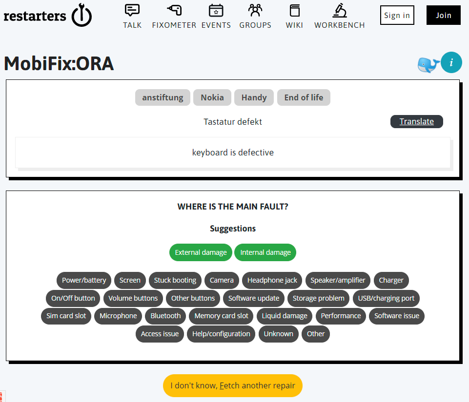

# MobiFix: A quest for fault types

This dataset is the result of two online quests where volunteer participants looked at about 1900 mobile phone repair attempts recorded at community events. For more information about repair events and data, visit the [Open Repair Alliance](https://openrepair.org/open-data/) website.

[MobiFix](https://talk.restarters.net/t/get-involved-in-repair-data-with-mobifix/3142) was held in July 2020 using data from ORA partner The Restart Project.

[MobiFix:ORA](https://restarters.net/mobifixora/status) was held in March 2021 using data from ORA partners anstiftung and Repair Café International.

The aim of these quests was to sort the records into buckets of fault “types”.

Community repair events are busy with volunteers concentrating their efforts on the people and the devices that turn up. The data that gets recorded by a fixer is their description of the situation at the time. Our participants would read this "problem" text and judge whether it fitted any of the "fault types" that were presented.

